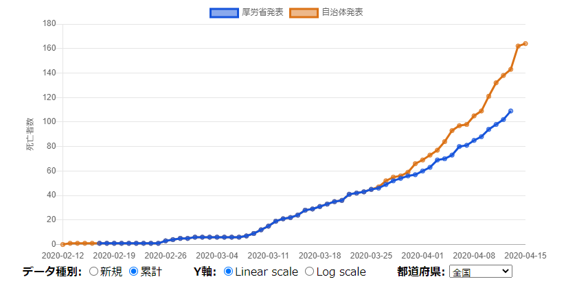

# 厚労省発表と自治体発表の死亡者数の比較
新型コロナウイルス(COVID-19)感染者数の統計について、厚生労働省は突合作業が完了した死亡者数のみを発表しているため、自治体発表の死亡者数とずれが生じています。このチャートでは、それぞれの発表の死亡者数を比較します。

## サイト
- Github: https://github.com/xyx-is/covid19-fatal-diff (バグ報告・その他何かありましたらIssueへ)
- Github Pages: https://xyx-is.github.io/covid19-fatal-diff/

## データソース・ライブラリ
- 自治体発表の集計: [新型コロナウイルス感染速報](https://github.com/swsoyee/2019-ncov-japan/blob/master/Data/death.csv) 様より
  - [MITライセンス](https://github.com/swsoyee/2019-ncov-japan/blob/master/LICENSE)
- 厚労省発表: 東洋経済オンライン[「新型コロナウイルス国内感染の状況」](https://github.com/kaz-ogiwara/covid19/blob/master/data/data.json) 様より
  - [MITライセンス](https://github.com/kaz-ogiwara/covid19/blob/master/LICENSE)
- チャート描画: [Chart.js](https://www.chartjs.org/)
  - [MITライセンス](https://github.com/chartjs/Chart.js/blob/master/LICENSE.md)

## ライセンス
このリポジトリ自体のコードのライセンスはPublic Domainです。
